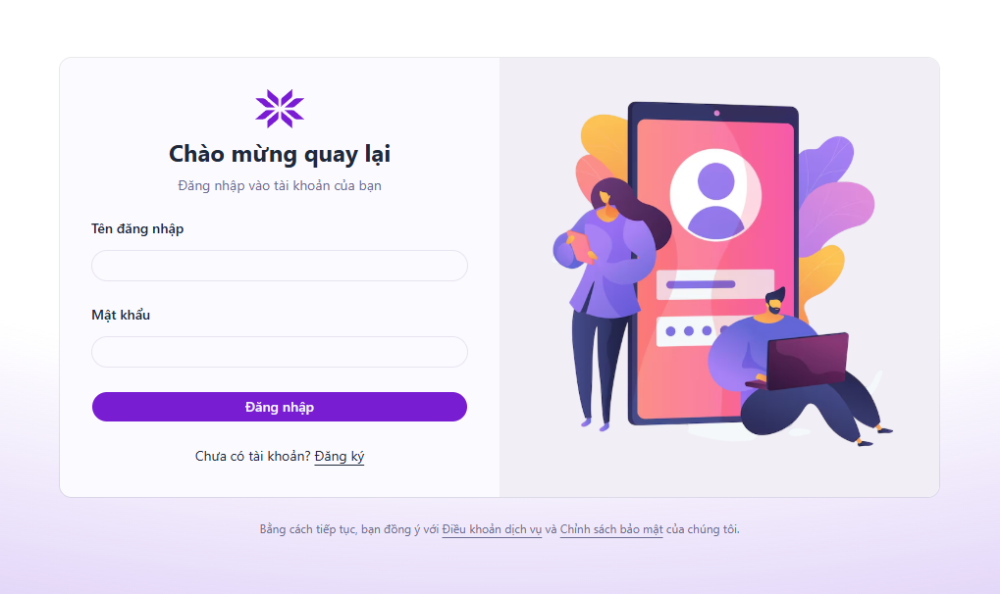
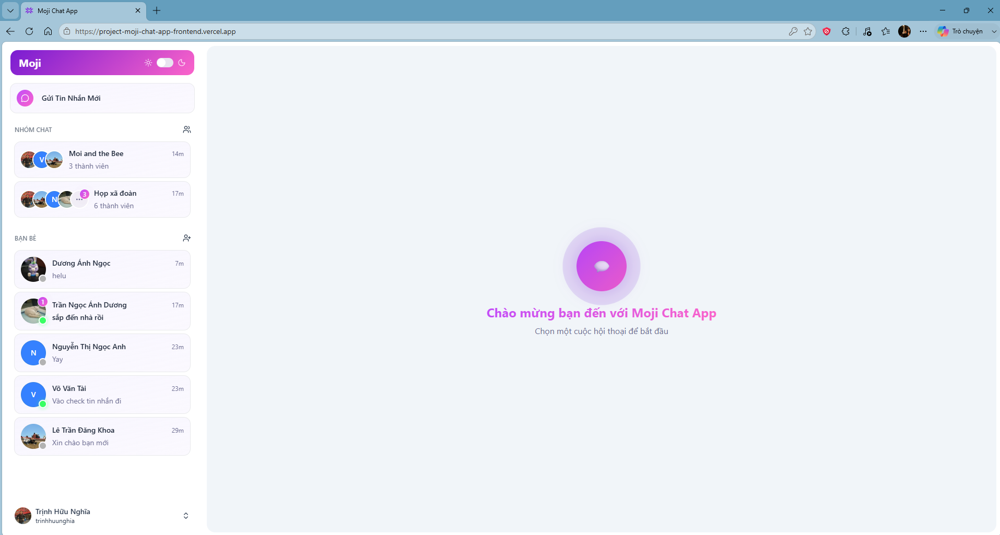
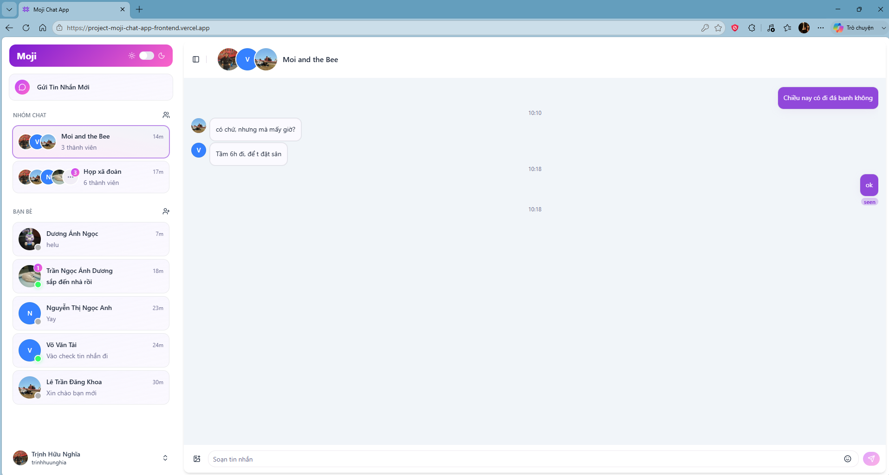
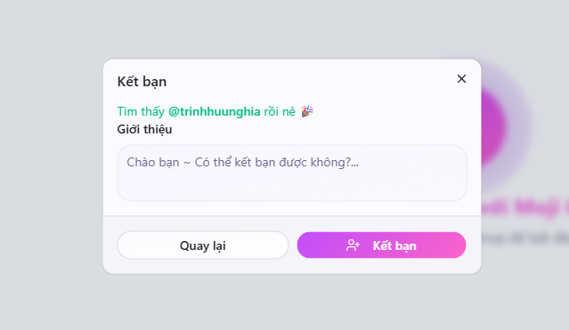
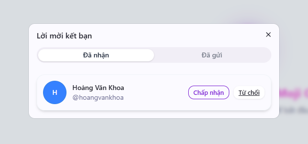
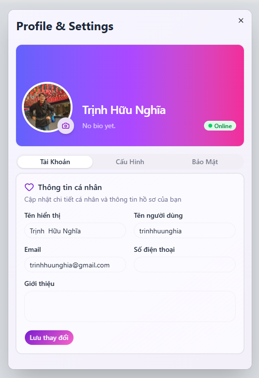

# Moji Chat App - Realtime Chatapp

A full-stack real-time chat application built with the MERN stack, featuring secure authentication, real-time messaging, avatar uploads, and modern user experience enhancements.

## Overview

This app is a real-time messaging platform developed to explore full-stack application architecture, authentication workflows, and WebSocket-based communication.

The application enables users to create accounts, authenticate securely using JWT, communicate in real time, upload profile avatars, and enjoy a modern chat experience with emoji support and infinite scrolling.

## Tech Stack

### Frontend (Vercel)
- React
- Vite
- Tailwind CSS
- React Router
- Axios
- Zustand
- React Hook Form
- Zod
- Socket.IO Client

### Backend (Render)
- Node.js
- Express.js
- Socket.IO
- JWT Authentication
- Swagger

### Database
- MongoDB
- Mongoose

### Cloud Services
- Cloudinary

## Features

### Authentication & Authorization
- User Registration
- User Login
- User Logout
- JWT Authentication
- Access Token & Refresh Token Workflow
- Protected Routes
- Password Hashing

### Real-Time Messaging
- Instant message delivery using Socket.IO
- Real-time communication between connected users
- Live message updates without page refresh

### User Profile
- Upload avatar images
- Cloudinary image storage
- Profile management

### Chat Experience
- Emoji picker integration
- Infinite scrolling for message history
- Toast notifications
- Responsive user interface

### API Documentation
- Swagger API documentation

### Security
- Password hashing with bcrypt
- JWT-based authentication
- Access token validation
- Refresh token mechanism
- Protected API endpoints
- Cookie-based token handling

## Architecture

Frontend (React + Zustand) ➡️ REST API (Express.js) ➡️ Authentication Layer (JWT) ➡️ MongoDB Database ↔️ Socket.IO ➡️ Real-time Communication

## Learning Objectives

This project was created to gain practical experience with:

- Authentication & Authorization
- JWT, Access Tokens, and Refresh Tokens
- Real-Time Communication
- WebSocket Architecture
- File Upload Handling
- Cloud Storage Integration
- Form Validation
- State Management
- Full-Stack MERN Development

## Deploy 

🚀 [Run Backend at Render first](https://project-moji-chat-app-backend.onrender.com/)

🚀 [Live Demo at Vercel](https://project-moji-chat-app-frontend.vercel.app/)

## Screenshots

